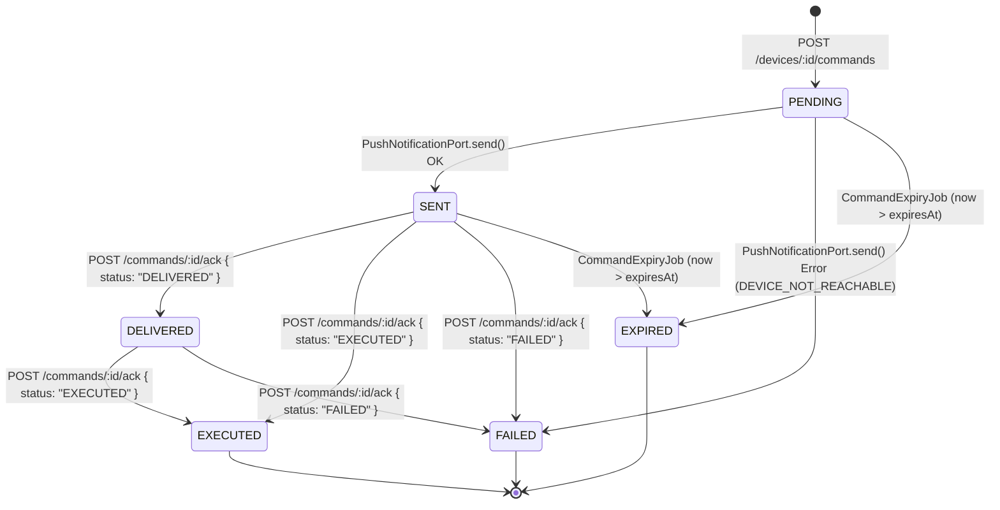

# API Specification - Part 3: Commands Pipeline (RING & FCM Delivery)

## Base URL
- Local: `http://localhost:3000`
- Android Emulator: `http://10.0.2.2:3000` or `http://localhost:3000` via `adb reverse tcp:3000 tcp:3000`
- Swagger UI Documentation: `http://localhost:3000/docs`
- OpenAPI Specification: [`openapi.yaml`](../../openapi.yaml)

---

## Architecture & Lifecycle State Machine

Commands represent instructions dispatched by authenticated users to their registered `PROTECTED` devices.
They are delivered asynchronously via Firebase Cloud Messaging (FCM) data-only high-priority push messages and acknowledged back by the device hardware daemon.

### State Transitions



- **Final States**: `EXECUTED`, `FAILED`, `EXPIRED`. Once in a final state, transitions are rejected with `409 Conflict` (`INVALID_STATE_TRANSITION`).
- **Idempotency**: Repeated acknowledgments of the same state (e.g. repeated `DELIVERED` or `EXECUTED`) are idempotent and return the current command without error.

---

## FCM Push Notification Specification

Commands use data-only messages to guarantee background delivery to the Android/iOS client daemon without triggering default OS notifications:

- **Type**: Data-only message (`message.data`)
- **Android Priority**: `high` (`android: { priority: "high", ttl: TTL_SECONDS * 1000 }`)
- **TTL**: Configured via `COMMAND_TTL_SECONDS` (default: 300 seconds)

### FCM Data Payload Structure:
```json
{
  "commandId": "36d94073-7669-4cbd-a90d-4e9d29ab25f9",
  "type": "RING",
  "payload": "{\"durationSeconds\":30}",
  "expiresAt": "2026-10-06T14:26:41.000Z"
}
```

---

## Automatic Expiry Background Job

- **Interval**: Runs every 30 seconds (`@Cron('*/30 * * * * *')`).
- **Target**: Any non-final command (`PENDING`, `SENT`) where `expiresAt < now`.
- **Action**: Transitions status to `EXPIRED` with `failureReason = 'COMMAND_EXPIRED'`.

---

## Endpoints

### 1. Send Command to Device
- **Method**: `POST`
- **Path**: `/devices/:id/commands`
- **Auth Required**: YES (`Authorization: Bearer <accessToken>`)
- **Preconditions**:
  - Authenticated user must own the device (returns `404 Not Found` if not owned).
  - Target device mode must be `PROTECTED` (returns `409 Conflict` `DEVICE_NOT_PROTECTED` otherwise).
  - Target device must have an `fcmToken` (returns `409 Conflict` `DEVICE_NOT_REACHABLE` otherwise).

#### Request Body
```json
{
  "type": "RING",
  "payload": {
    "durationSeconds": 30
  }
}
```
*Validation:* `type` must be `"RING"`. `payload.durationSeconds` optional integer between 1 and 300 (defaults to 30).

#### Response: `201 Created`
```json
{
  "id": "8f2ad84c-a815-49d7-bfdb-0ad089bed2b2",
  "deviceId": "1c719db6-c091-4f31-846a-f7b2b981a7e0",
  "issuedById": "ff01838d-fb4c-4a40-99fd-01e79d9469f8",
  "type": "RING",
  "payload": {
    "durationSeconds": 30
  },
  "status": "SENT",
  "failureReason": null,
  "createdAt": "2026-10-06T14:21:41.631Z",
  "sentAt": "2026-10-06T14:21:42.000Z",
  "deliveredAt": null,
  "executedAt": null,
  "expiresAt": "2026-10-06T14:26:41.631Z"
}
```

#### Error Responses
- `404 Not Found`: `{"error":{"code":"DEVICE_NOT_FOUND","message":"Device not found"}}`
- `409 Conflict`: `{"error":{"code":"DEVICE_NOT_PROTECTED","message":"Commands can only be sent to devices in PROTECTED mode"}}`
- `409 Conflict`: `{"error":{"code":"DEVICE_NOT_REACHABLE","message":"Target device does not have an FCM token registered"}}`
- `409 Conflict`: `{"error":{"code":"DEVICE_NOT_REACHABLE","message":"Target device FCM token is invalid or unregistered"}}` (Clears invalid FCM token automatically).

---

### 2. List Device Commands
- **Method**: `GET`
- **Path**: `/devices/:id/commands`
- **Auth Required**: YES (`Authorization: Bearer <accessToken>`)
- **Description**: Returns all commands issued for the specified device owned by the user, ordered newest first.

#### Response: `200 OK`
```json
[
  {
    "id": "8f2ad84c-a815-49d7-bfdb-0ad089bed2b2",
    "deviceId": "1c719db6-c091-4f31-846a-f7b2b981a7e0",
    "issuedById": "ff01838d-fb4c-4a40-99fd-01e79d9469f8",
    "type": "RING",
    "payload": {
      "durationSeconds": 30
    },
    "status": "SENT",
    "failureReason": null,
    "createdAt": "2026-10-06T14:21:41.631Z",
    "sentAt": "2026-10-06T14:21:42.000Z",
    "deliveredAt": null,
    "executedAt": null,
    "expiresAt": "2026-10-06T14:26:41.631Z"
  }
]
```

---

### 3. Get Command Details
- **Method**: `GET`
- **Path**: `/commands/:id`
- **Auth Required**: YES (`Authorization: Bearer <accessToken>`)
- **Description**: Retrieves single command details. Returns `404 Not Found` if not found or if the device does not belong to the user.

#### Response: `200 OK`
```json
{
  "id": "8f2ad84c-a815-49d7-bfdb-0ad089bed2b2",
  "deviceId": "1c719db6-c091-4f31-846a-f7b2b981a7e0",
  "issuedById": "ff01838d-fb4c-4a40-99fd-01e79d9469f8",
  "type": "RING",
  "payload": {
    "durationSeconds": 30
  },
  "status": "SENT",
  "failureReason": null,
  "createdAt": "2026-10-06T14:21:41.631Z",
  "sentAt": "2026-10-06T14:21:42.000Z",
  "deliveredAt": null,
  "executedAt": null,
  "expiresAt": "2026-10-06T14:26:41.631Z"
}
```

---

### 4. Acknowledge Command (Device Daemon)
- **Method**: `POST`
- **Path**: `/commands/:id/ack`
- **Auth Required**: YES (`Authorization: Device <deviceToken>`)
- **Description**: Called directly by the physical device hardware daemon when receiving, executing, or failing a command.

#### Request Body
```json
{
  "status": "DELIVERED",
  "reason": null
}
```
*Validation:* `status` must be `"DELIVERED"`, `"EXECUTED"`, or `"FAILED"`. `reason` optional string (required/recommended when `status` is `"FAILED"`).

#### Response: `200 OK`
```json
{
  "id": "8f2ad84c-a815-49d7-bfdb-0ad089bed2b2",
  "deviceId": "1c719db6-c091-4f31-846a-f7b2b981a7e0",
  "issuedById": "ff01838d-fb4c-4a40-99fd-01e79d9469f8",
  "type": "RING",
  "payload": {
    "durationSeconds": 30
  },
  "status": "DELIVERED",
  "failureReason": null,
  "createdAt": "2026-10-06T14:21:41.631Z",
  "sentAt": "2026-10-06T14:21:42.000Z",
  "deliveredAt": "2026-10-06T14:22:00.000Z",
  "executedAt": null,
  "expiresAt": "2026-10-06T14:26:41.631Z"
}
```

#### Error Responses
- `401 Unauthorized`: Missing or invalid `Device` authentication token.
- `403 Forbidden`: `{"error":{"code":"FORBIDDEN","message":"Device is not the target of this command"}}`
- `404 Not Found`: `{"error":{"code":"COMMAND_NOT_FOUND","message":"Command not found"}}`
- `409 Conflict`: `{"error":{"code":"INVALID_STATE_TRANSITION","message":"Cannot transition command from FAILED to DELIVERED"}}`
